# Awesome Search Engine Optimization (SEO) Platforms 🚀

  

  
  
  
  
  

---

## 📌 Overview

A curated list of **top SaaS platforms** and **open-source GitHub projects** for Search Engine Optimization (SEO), technical site auditing, rank tracking, backlink analysis, and content optimization.

Whether you are looking for enterprise commercial software like Semrush and Ahrefs or powerful self-hosted open-source crawlers like Crawlee and Google Lighthouse, this directory covers the best tools available for marketers, developers, and webmasters.

---

## 📊 Market Size & Structure

> 💡 **Market Insights**: The global Search Engine Optimization (SEO) software market size is estimated at **$7.5 Billion to $10 Billion**, growing at a CAGR of 14.2%. The market is **moderately fragmented**: enterprise analytics and proprietary backlink/keyword indexes are concentrated among a few dominant SaaS market leaders (Semrush, Ahrefs, Moz, BrightEdge), while technical site crawling, performance auditing, and rank tracking feature a vibrant, highly fragmented ecosystem of open-source tools and specialized software.

---

## 🏢 SaaS & Hosted Platforms

Below is a breakdown of top commercial SEO software platforms sorted by company size (valuation / revenue):

| Company / Product | Size (Valuation / Revenue) 💰 | Starting Price 💳 | Free Tier / Trial Limits 🎁 | Key Features & Focus 🎯 |
| :--- | :--- | :--- | :--- | :--- |
| **[Google Search Console](https://search.google.com/search-console/)** 🛠️ | **$2.0+ Trillion** (Parent: Alphabet) | Free ($0/mo) | **100% Free Forever** (Unlimited usage; standard API quotas apply) | Official Google performance dashboard, indexing control, Core Web Vitals |
| **[Bing Webmaster Tools](https://www.bing.com/webmasters)** 🌐 | **$3.0+ Trillion** (Parent: Microsoft) | Free ($0/mo) | **100% Free Forever** (Unlimited usage; standard indexing quotas apply) | Search performance reports, sitemap submissions & SEO diagnostics for Bing |
| **[Semrush](https://www.semrush.com/)** ⚡ | **$1.9 Billion** Valuation ($456M ARR) | $139.95/mo | **7-Day Free Trial** (Pro / Guru plans) | Comprehensive all-in-one SEO suite, competitor intelligence, PPC & backlinks |
| **[Ahrefs](https://ahrefs.com/)** 🎯 | **$150 Million ARR** (Bootstrapped) | $129.00/mo (or $29/mo Starter) | **Ahrefs Webmaster Tools Free** (5,000 crawl credits/mo for verified sites; No paid trial) | Industry-leading backlink index, Site Explorer & Keyword Explorer |
| **[BrightEdge](https://www.brightedge.com/)** 🏢 | **$100+ Million ARR** (Private) | Custom Enterprise Quote (~$1,000+/mo) | **No Free Trial** (Demo on request) | Enterprise SEO platform with AI content recommendations & share of voice |
| **[Conductor](https://www.conductor.com/)** 🚀 | **$210+ Million Total Funding** (Private) | Custom Enterprise Quote (~$3,000+/mo) | **No Free Trial** (Demo on request) | Enterprise content intelligence, organic marketing workflow automation |
| **[Moz Pro](https://moz.com/products/pro)** 📈 | **$50+ Million ARR** (Private) | $99.00/mo (or $49/mo Starter) | **7-Day Free Trial** (Medium Plan access) | Domain Authority (DA) creator, Rank tracking, link explorer & site audits |
| **[SE Ranking](https://seranking.com/)** 📊 | **$30+ Million Revenue** (Private) | $103.20/mo (Core plan) | **14-Day Free Trial** (No credit card required) | All-in-one SEO suite, white-label reporting & rank tracking for agencies |
| **[SpyFu](https://www.spyfu.com/)** 🔍 | **$15+ Million Revenue** (Private) | $39.00/mo (or $29/mo annual) | **Free Forever Version** (Limited search results) | Competitor keyword research, PPC ad history & domain domain analysis |
| **[Screaming Frog SEO Spider](https://www.screamingfrog.co.uk/seo-spider/)** 🐸 | **$10+ Million Revenue** (Private) | $279.00/year (£199/yr) | **Free Plan Available** (Capped at 500 URLs per crawl) | Industry-standard desktop crawler for technical SEO site audits |

---

## 💻 Open-Source GitHub Projects

Explore open-source alternatives and libraries for web crawling, performance measurement, automated SEO auditing, and rank tracking. Projects are sorted by GitHub Stars_Count (descending):

| Repository 📦 | GitHub_Stars ⭐ | Primary Stack 🛠️ | Description & Use Case 📝 |
| :--- | :--- | :--- | :--- |
| **[puppeteer/puppeteer](https://github.com/puppeteer/puppeteer)** 🌐 |  | Node.js / JavaScript | Headless Chrome Node.js API for automated web scraping & dynamic rendering SEO audits |
| **[scrapy/scrapy](https://github.com/scrapy/scrapy)** 🕷️ |  | Python | Fast high-level web crawling & scraping framework for enterprise site audits |
| **[GoogleChrome/lighthouse](https://github.com/GoogleChrome/lighthouse)** ⚡ |  | JavaScript / Node.js | Google's official automated auditing tool for performance, Core Web Vitals & SEO |
| **[apify/crawlee](https://github.com/apify/crawlee)** 🤖 |  | Node.js / TypeScript / Python | Scalable web scraping & browser automation library with proxy rotation for custom crawlers |
| **[GoogleChrome/lighthouse-ci](https://github.com/GoogleChrome/lighthouse-ci)** 🔄 |  | JavaScript / Node.js | Continuous Integration wrapper for Lighthouse to track performance budgets & SEO regressions |
| **[sethblack/python-seo-analyzer](https://github.com/sethblack/python-seo-analyzer)** 🐍 |  | Python | Python SEO tool that crawls a site and analyzes structure, broken links & HTML tags |
| **[serphacker/serposcope](https://github.com/serphacker/serposcope)** 📈 |  | Java | Open-source rank tracker to monitor Google website rankings and keyword performance |
| **[seopanel/Seo-Panel](https://github.com/seopanel/Seo-Panel)** 🖥️ |  | PHP / MySQL | Open-source SEO control panel for agencies managing multiple client sites & rank tracking |
| **[oxffaa/gopher-parse-sitemap](https://github.com/oxffaa/gopher-parse-sitemap)** 🗺️ |  | Go | Lightweight and fast Go library for memory-efficient XML sitemap parsing |
| **[MarsX-dev/seobot](https://github.com/MarsX-dev/seobot)** 🤖 |  | TypeScript | Open-source AI content generation & programmatic SEO publishing bot |

---

## 🛠️ Additional Categories & Utilities

- **Schema Markup Validators**: Check structured data compliance (JSON-LD, Microdata) via Schema.org tools.
- **Redirect Chain Checkers**: Audit HTTP status codes (301, 302, 404) across site migrations.
- **Sitemap Generators**: Automate XML sitemap compilation within CI/CD pipelines.

---

## 🤝 How to Contribute

Contributions are welcome! Please follow these simple guidelines:

1. Fork the repository 🍴
2. Create a new branch for your feature or tool addition
3. Add your entry to `README.md` maintaining table formatting
4. Submit a Pull Request (PR) with a brief description 🚀

---

## 💖 Support & Sponsoring

If you find this repository useful, please consider supporting the project:

- ⭐ **Star this repository** to show your appreciation.
- 🍴 **Fork it** to contribute or customize your own list.
- 📢 **Share it** with fellow developers, SEO specialists, and digital marketers.

☕ **Buy Me a Coffee / Sponsor**: Support ongoing maintenance and curation on GitHub Sponsors:  
👉 **[Sponsor on GitHub](https://github.com/sponsors/ishandutta2007)** ❤️

---

## 📜 Disclaimer

- This repository is a community-curated collection.
- Always respect `robots.txt` and terms of service when running custom web crawlers.
- Open-source tools provide great crawling and auditing foundations, but commercial platforms (Ahrefs, Semrush) hold proprietary backlink databases that cannot be easily replicated open-source.

---

## 📊 Star History

---

  Made with ❤️ for SEO professionals, web developers, and digital marketers worldwide.

